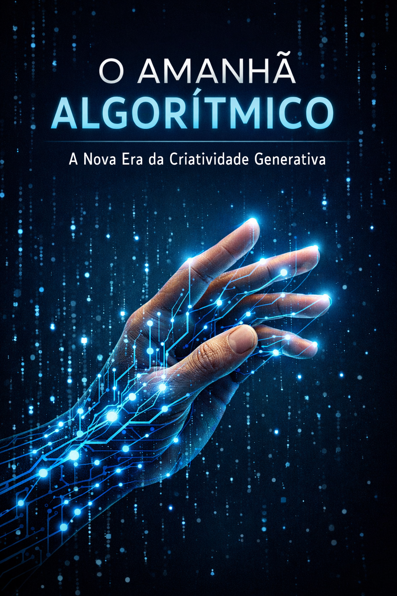

O Amanhã Algorítmico: A Nova Era da Criatividade Generativa

📒 Descrição

Este projeto, desenvolvido para o desafio "Lab Natty or Not" da Digital Innovation One (DIO), explora o potencial das IAs Generativas na criação de conteúdo. Através de um e-book intitulado "O Amanhã Algorítmico: Como a IA Generativa está Redefinindo a Criatividade", investigamos a fronteira entre a criatividade humana e a capacidade algorítmica, questionando a autenticidade da arte gerada por máquinas e como essa colaboração redefine o processo criativo.

🤖 Tecnologias Utilizadas

•
Google Gemini: Utilizado para a geração do conteúdo textual do e-book e para auxiliar na estruturação do README.

•
Ferramenta de Geração de Imagens (AI Generativa): Empregada para criar a imagem de capa do e-book, buscando um visual futurista e conceitual que representasse a fusão entre o humano e o digital.

🧐 Processo de Criação

O processo de criação deste projeto seguiu as seguintes etapas:

1.
Definição do Conceito: Inspirado no desafio "Natty or Not", o tema "O Amanhã Algorítmico: A Nova Era da Criatividade Generativa" foi escolhido para explorar a autenticidade e o impacto das IAs generativas na criatividade.

2.
Geração da Capa do E-book: Uma imagem de capa futurista e minimalista foi gerada utilizando uma IA generativa, com o prompt focado em uma fusão de elementos humanos e digitais para representar o tema central do e-book. A imagem foi criada com o título "O Amanhã Algorítmico" e o subtítulo "A Nova Era da Criatividade Generativa".

3.
Criação do Conteúdo do E-book: O texto completo do e-book foi desenvolvido com o auxílio do Google Gemini, abordando tópicos como a definição de IA generativa, o debate "Natty or Not" no contexto da IA, o papel da IA como catalisador criativo, e os desafios éticos e considerações futuras.

4.
Estruturação do README: Este arquivo README.md foi montado seguindo o template fornecido pela DIO, detalhando a descrição do projeto, as tecnologias utilizadas, o processo de criação e os resultados obtidos.

🚀 Resultados

O principal resultado deste projeto é o e-book "O Amanhã Algorítmico: A Nova Era da Criatividade Generativa", que oferece uma análise aprofundada sobre o tema. A capa do e-book, gerada por IA, complementa visualmente o conteúdo, transmitindo a essência futurista e colaborativa da criatividade na era da inteligência artificial.

Capa do E-book

Conteúdo do E-book

O conteúdo completo do e-book pode ser acessado no arquivo ebook_ia.md neste repositório.

💭 Reflexão

Criar conteúdo "natty" (autêntico e original) com IA generativa é um desafio fascinante que nos força a reavaliar a própria natureza da criatividade. A IA não substitui a centelha humana, mas a amplifica, oferecendo novas ferramentas e perspectivas. O verdadeiro "natty" reside na curadoria, na intenção e na capacidade humana de guiar a IA para expressar ideias complexas e significativas. Este projeto demonstrou como a colaboração humano-IA pode gerar resultados que são, ao mesmo tempo, tecnologicamente avançados e conceitualmente ricos, provando que a autenticidade pode emergir da simbiose entre a mente e a máquina.

